### A brief explanation about methods that this project provides is given in this document <br/> <br/>
------------------------------------------------------
**installing and running zookeeper, Kafka and Kafka-manager :<br/>**
<br/>
Go to the project directory and use the following command to install requirements:
```
docker-compose -f docker-compose.yml up
```
<br/>
------------------------------------------------------
**plotLineChart method :<br/>**
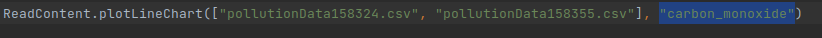
<br/>
Calling this staticmethod on CSV files will plot values of second argument (E.g. "carbon_monoxide") with regards to tiemstamps. First argument containing the CSV files names, can include multiple files or just one. In case multiple files gives, charts will be plotted separately. X axis which includes timestamps, is not a standard time line, but it is set based on the data available in the CSV fiel, in other words X axis only contains ticks which are in the CSV file and not based on a regular standard time line.
<br/>
**example 1** :
<br/>
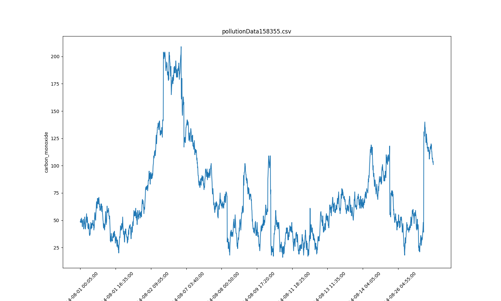

**example 2** :
<br/>
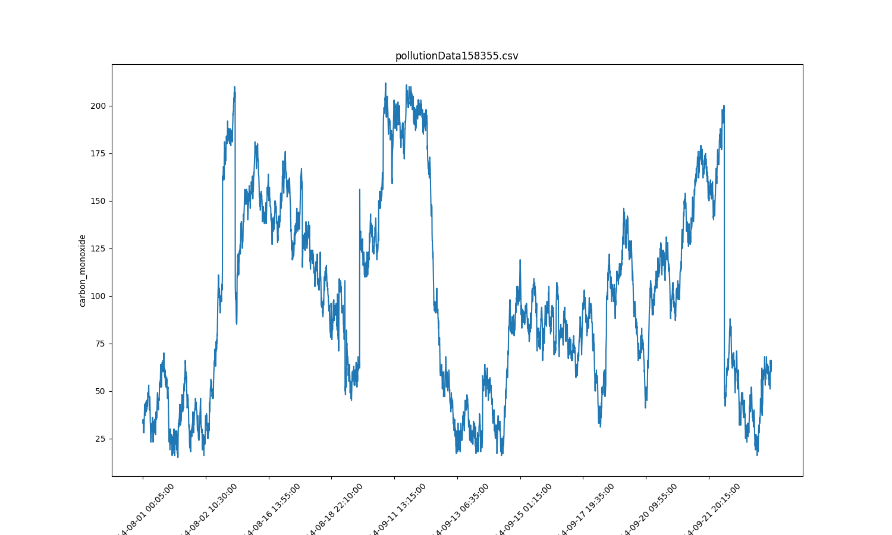
<br/>

------------------------------------------------------
**plotCustomLineCharts method :<br/>**
<br/>
Arguments if this staticmethod are lists which contain full address or just the name of the file as first element and the column header to be plotted as second element of the list. X axises are regular standard time lines and x axis ticks contain all timestamps even if they are not in the CSV file's rows. Examples are as follow:
<br/>

**example 1** : 
<br/>

<br/>
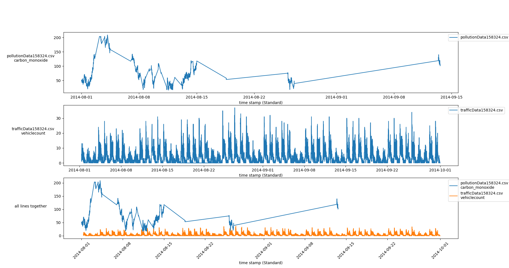

**example 2** : 
<br/>
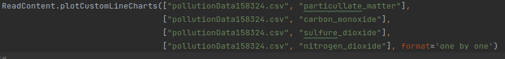
<br/>
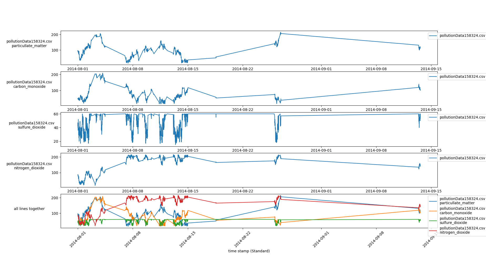

**example 3** :
<br/>
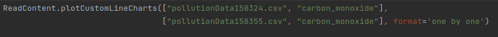
<br/>
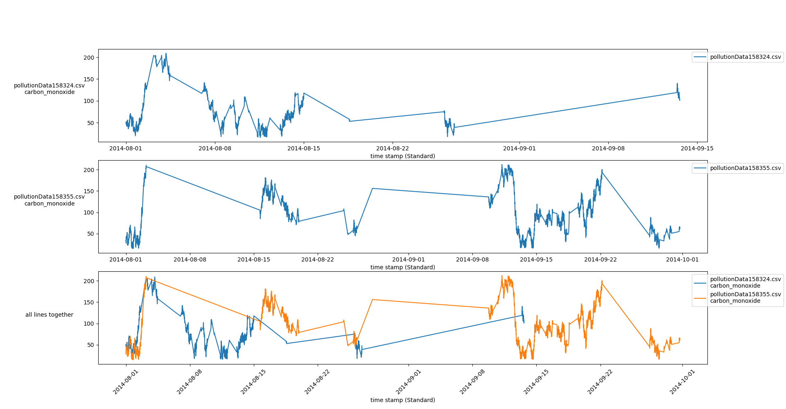
<br/>
**example 4** :
<br/>
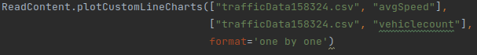
<br/>
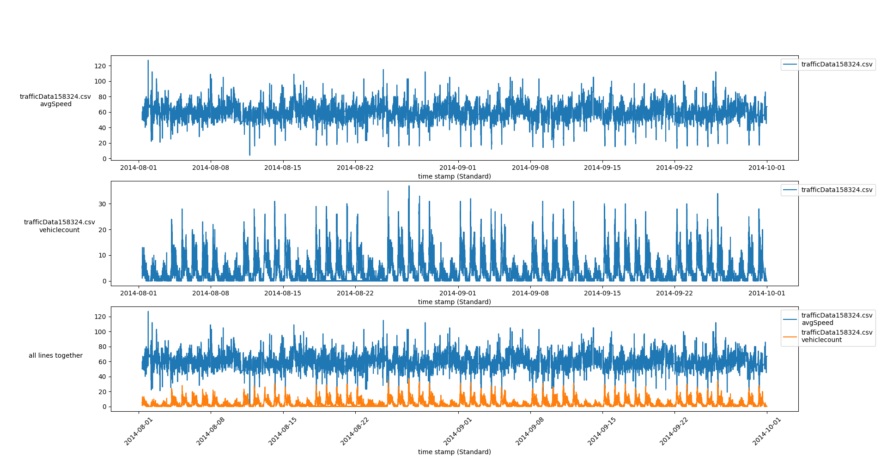
<br/>
**example 5** :
<br/>

<br/>

------------------------------------------------------
**createFormattedAddressColumn method :<br/>**
<br/>
Calling this classmethod on CSV files which include data referring to a physical location (E.g. "latitude" and "longitude" as the initial data of a location) will add a new column called: "Formatted Address" containing the formatted address of the initial location. An example of this method's function is given below:
<br/> <br/>
initial .CSV file :
<br/>
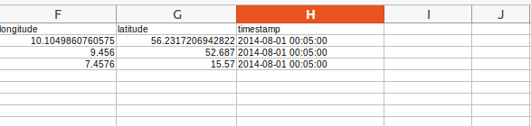

final .CSV file :
<br/>

<br/> 

A SQL database containing initial and formatted addresses of location is created for higher effiency:
<br/>
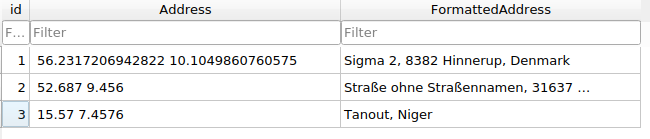
<br/> 

------------------------------------------------------

**removeRowsThatViolateAllConditions method :<br/>**
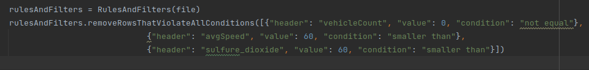
<br/>
Calling this classmethod on CSV files, will filter rows based on the conditions that are given (E.g. "vehicleCount" msut not be 0), for instance in case method depicted in image above is called, rows that their "vehicleCount" value is equal to 0 **and** their "avgSpeed" value is larger than 60 **and** their "sulfure_dioxide" value is larger than 60 will be removed. If rows lack the given headers, related filter will be ignored and other filters will be applied.
<br/> <br/>
initial .CSV file :
<br/>
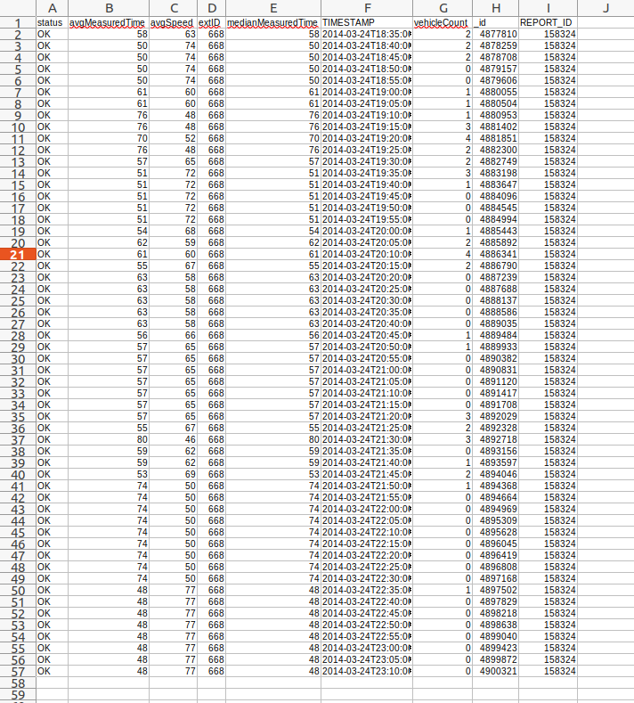

final .CSV file :
<br/>
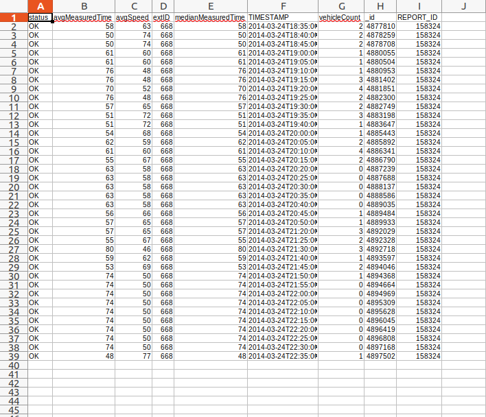
<br/> 
