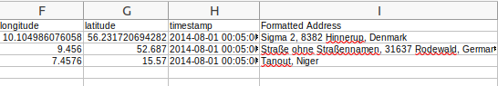

# CSV-Modificator
### A brief explanation about each method and its arguments    

**createFormattedAddressColumn method : **

 
Calling this classmethod on CSV files which include data referring to a physical location (E.g. "latitude" and "longitude" as the initial data of a location) will add a new column called: "Formatted Address" containing the formatted address of the initial location. An example of this method's function is given below:
   
initial .CSV file :
 

final .CSV file :
 

  

A SQL database containing initial and formatted addresses of location is created for higher effiency:
 

  

------------------------------------------------------
